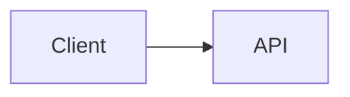
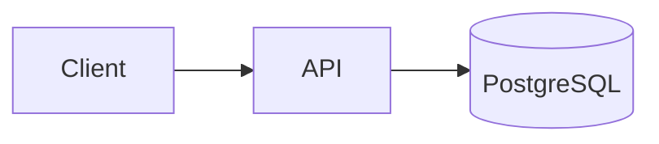
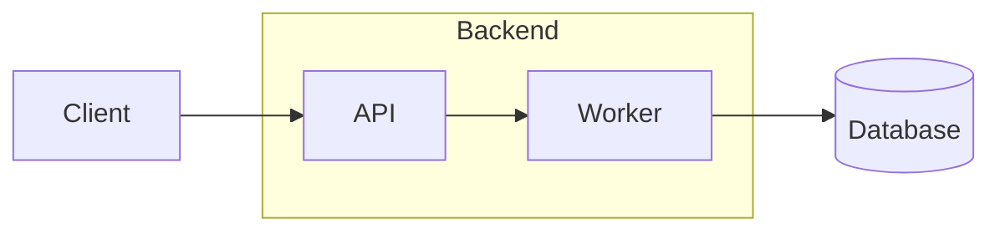
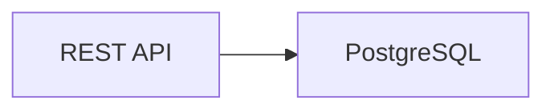
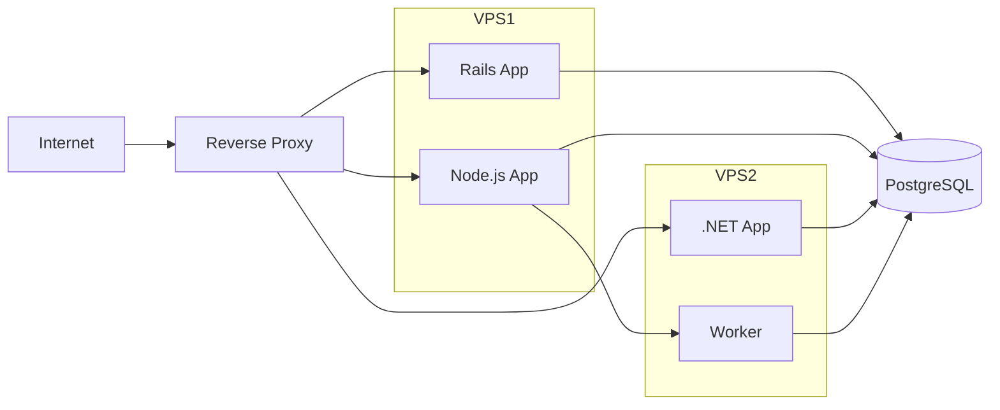
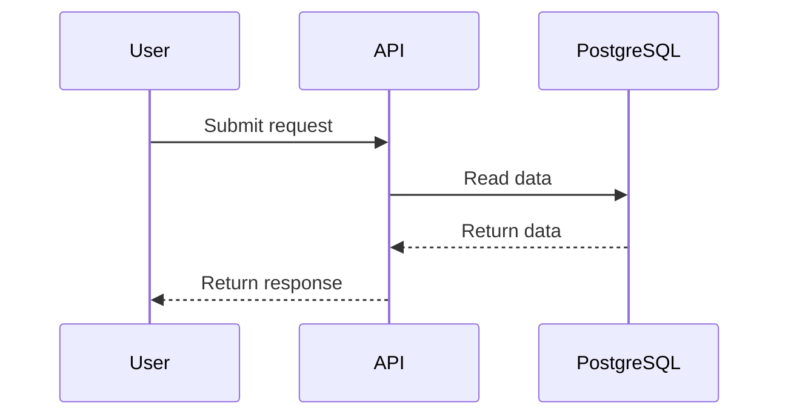
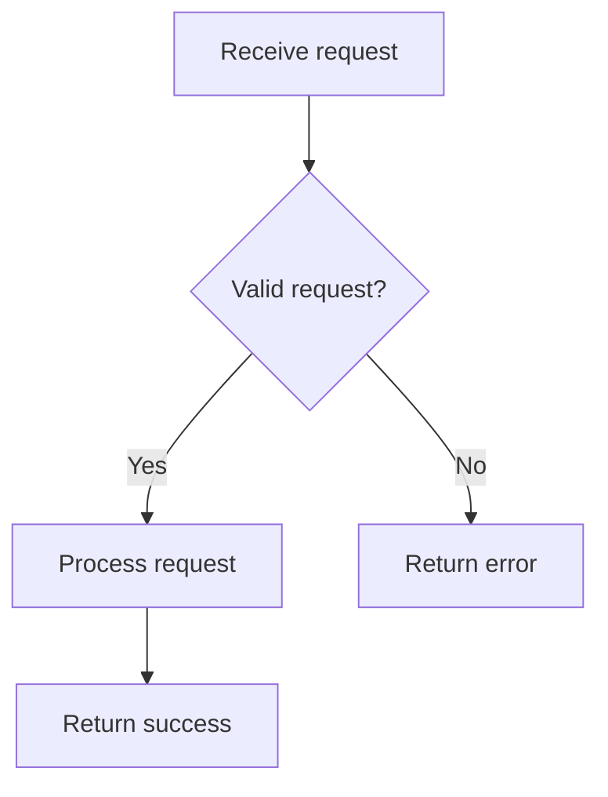

# Azure-compatible Mermaid

Generate Mermaid diagrams that render in Azure DevOps Markdown without unnecessarily breaking compatibility with VS Code and other standard Mermaid previews.

## Core policy

Treat Azure DevOps as the minimum compatibility target.

When multiple valid Mermaid syntaxes can express the same diagram, choose the simplest syntax supported by Azure DevOps and standard Markdown Mermaid renderers.

Do not use newer Mermaid syntax merely because it is shorter, prettier, or supported by a local editor.

## Trigger conditions

Use this skill automatically when the user asks to:

- document a flow or workflow;
- document architecture or infrastructure;
- show a request, event, queue, job, deployment, or CI/CD lifecycle;
- create a sequence diagram;
- create a state machine;
- describe relationships between services, databases, entities, classes, or components;
- create a technical diagram for README, docs, wiki, ADR, runbook, repository documentation, or Azure DevOps;
- convert a textual technical explanation into Mermaid;
- review, fix, simplify, or make an existing Mermaid diagram portable.

If the user explicitly requests PlantUML, Graphviz, D2, Excalidraw, draw.io, or another format, follow that request instead.

## Required Markdown format

Always use standard fenced Mermaid blocks:

````markdown

````

Do not generate Azure-only `::: mermaid` containers unless the user explicitly asks for the legacy Azure syntax.

The fenced form is the portable default.

## Flowcharts

For flow diagrams:

- MUST use `graph`, not `flowchart`.
- Prefer `graph LR` for pipelines, request paths, integrations, and horizontal architectures.
- Prefer `graph TD` for decision trees and hierarchical processes.
- Use ordinary arrows such as `-->`, `---`, `-.->`, and labeled `-->|label|`.
- MUST NOT use the Mermaid LongArrow syntax `---->`.
- Keep node IDs simple ASCII identifiers such as `API`, `DB`, `Worker1`, `AuthService`.

Preferred:



Avoid:

```text
flowchart LR
Client ----> API
```

## Subgraphs

Subgraphs may be used only as visual grouping.

Do not connect edges directly to or from a `subgraph` container.

Incorrect:

```text
A --> SUBGRAPH
SUBGRAPH --> B
```

Instead, connect to a node inside the subgraph:



If a diagram requires complex cross-subgraph routing, simplify it or split it into multiple diagrams.

## Labels and text

Use conservative text labels.

- Prefer plain text.
- Avoid HTML tags in node labels.
- Avoid `<br>`, `<br/>`, `<b>`, `<i>`, `<span>`, tables, or embedded HTML.
- Avoid Font Awesome icon syntax.
- Avoid renderer-specific icons.
- If a label contains punctuation that may confuse parsing, quote it.

Preferred:



For multiline concepts, prefer shortening the label instead of injecting HTML line breaks.

## Styling

Portability is more important than custom appearance.

By default:

- do not use themes;
- do not use `%%{init: ...}%%`;
- do not inject CSS;
- do not rely on custom fonts;
- avoid `classDef`, `style`, and advanced styling unless the user explicitly needs styling and it is known to be safe for the target Azure environment.

Use Mermaid's default rendering whenever possible.

## Diagram types

Prefer these diagram types when they fit the task:

### Process or architecture

Use:

```text
graph LR
```

or:

```text
graph TD
```

### Interaction between systems

Use:

```text
sequenceDiagram
```

Keep sequence syntax simple. Prefer participants, messages, notes, and basic activation only when necessary.

### State lifecycle

Use a conservative `stateDiagram-v2` only when the target Azure environment is known to render it. If compatibility is uncertain, represent the lifecycle with `graph LR` or `graph TD`.

When maximum Azure portability matters, prefer `graph`.

### Entity relationships

Use `erDiagram` for database/entity relationships when a real ER model is useful.

Keep identifiers and relationship labels simple.

If advanced ER syntax fails or is not required, fall back to `graph`.

### Class relationships

Use `classDiagram` only when classes, interfaces, inheritance, or composition are genuinely the subject.

For service architecture, use `graph` instead.

### Gantt, journey, requirement, gitgraph, timeline

Use these only when the requested information specifically benefits from that diagram type.

Do not choose a specialized Mermaid diagram merely for visual variety.

## Architecture conventions

For infrastructure and application architecture:

- represent runtime components as nodes;
- represent data stores distinctly but without renderer-specific styling;
- label protocols or responsibilities on edges only when useful;
- group related services using subgraphs, without linking to the subgraph itself;
- keep deployment topology separate from request/data flow if one diagram becomes crowded.

Example:



## Sequence conventions

Use explicit participants when names contain spaces or when aliases improve clarity.

Example:



Avoid advanced Mermaid sequence features unless required.

## Decision flow conventions

Use diamonds only for actual decisions.

Example:



Do not turn every step into a decision node.

## Complexity limits

Prefer readability over completeness in a single diagram.

As a default:

- target roughly 5 to 15 nodes per diagram;
- split diagrams that exceed about 20 meaningful nodes;
- avoid dense edge crossings;
- prefer one overview plus focused detail diagrams when documenting a complex system.

A documentation page may contain multiple Mermaid blocks.

## Output behavior

When the user asks for documentation rather than only a diagram:

1. Write the relevant explanatory Markdown.
2. Insert Mermaid blocks near the text they illustrate.
3. Keep the Mermaid source directly editable.
4. Do not replace Mermaid with an image unless explicitly requested.
5. Do not duplicate the same information excessively in prose and diagram.

When the user asks only for a diagram, return the Mermaid block and only the minimal explanation needed.

## Existing Mermaid review

When asked to fix or review an existing diagram:

1. Identify Azure-incompatible or risky syntax.
2. Preserve the diagram's meaning.
3. Replace incompatible constructs with the conservative equivalent.
4. Simplify styling and labels where necessary.
5. Return the corrected fenced Mermaid block.
6. Briefly mention material compatibility changes.

Common rewrites:

| Risky / incompatible | Portable replacement |
|---|---|
| `flowchart LR` | `graph LR` |
| `flowchart TD` | `graph TD` |
| `---->` | `-->` |
| direct edge to/from a `subgraph` | edge to a node inside the subgraph |
| HTML labels | plain quoted text |
| Font Awesome icons | plain text node |
| complex init/theme configuration | default Mermaid rendering |

## Validation checklist

Before finalizing any Mermaid output, verify:

- [ ] The block uses fenced ` ```mermaid ` Markdown.
- [ ] Flow diagrams use `graph`, never `flowchart`.
- [ ] No `---->` LongArrow is present.
- [ ] No edge targets a `subgraph` container.
- [ ] Labels do not rely on HTML.
- [ ] No Font Awesome or renderer-specific icons are required.
- [ ] Styling is absent or intentionally conservative.
- [ ] Node IDs are simple and unique.
- [ ] The diagram remains understandable without custom colors or themes.
- [ ] The syntax is expected to render in Azure DevOps and standard VS Code Mermaid preview.
- [ ] The diagram is not unnecessarily large or complex.

If any check fails, revise the Mermaid before returning it.

## Compatibility fallback

If uncertain whether a Mermaid feature is supported by Azure DevOps:

1. do not guess that a modern Mermaid feature is safe;
2. prefer `graph LR` or `graph TD`;
3. express the same relationship using basic nodes and edges;
4. split a complex diagram if needed;
5. preserve semantic clarity over visual sophistication.

The final artifact should remain useful as plain Markdown even if Mermaid rendering is unavailable.
