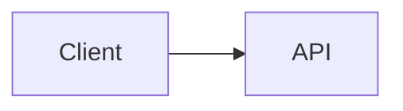

# Azure DevOps Mermaid compatibility reference

Validated: 2026-09-04

This reference supports the `azure-mermaid-compatible` skill.

## Current Azure DevOps baseline

Microsoft documentation currently states that Azure DevOps:

- supports Mermaid diagrams in Wiki/Markdown;
- supports standard fenced Markdown blocks with the `mermaid` language identifier;
- also continues to support the Azure-specific `::: mermaid` container;
- has limited Mermaid syntax support;
- does not support the `flowchart` diagram keyword and instructs authors to use `graph`;
- does not support LongArrow `---->`;
- does not support links to or from a `subgraph` container;
- does not support most HTML tags in Mermaid;
- does not support Font Awesome Mermaid syntax.

The standard fenced Mermaid syntax was added to Azure DevOps in the 2026 Wiki Sprint 274 update, specifically to improve portability with GitHub, VS Code, and other Markdown editors.

## Authoritative references

Microsoft Learn:
https://learn.microsoft.com/en-us/azure/devops/project/wiki/markdown-guidance?view=azure-devops

Azure DevOps Wiki Sprint 274 Update:
https://learn.microsoft.com/en-us/azure/devops/release-notes/2026/wiki/sprint-274-update

## Design principle

Use Azure DevOps as the compatibility floor, not as a separate Mermaid dialect.

Prefer:

````markdown

````

This syntax is portable Markdown and avoids maintaining one diagram representation for Azure DevOps and another for VS Code.

## Conservative fallback hierarchy

When a feature may be unsupported:

1. `graph LR` / `graph TD`
2. basic nodes
3. basic directed or undirected edges
4. quoted plain-text labels
5. multiple smaller diagrams

Avoid solving a rendering problem with more advanced Mermaid syntax.
